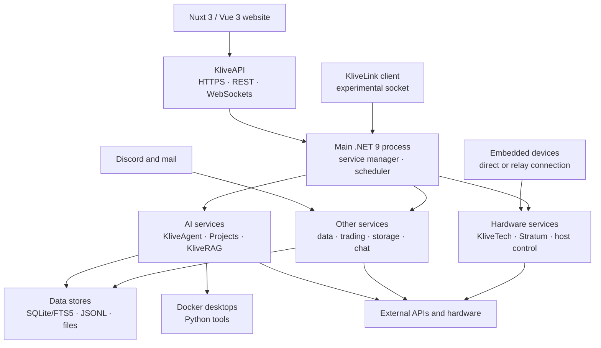

# Omnipotent

**Omnipotent is the Windows system I built to run AI agents, scheduled jobs, web services, simulations, and custom hardware from one place.**

**31 services started by `Program.cs` · 380 API routes defined in code · 1,363 passing tests · 135,905 non-empty lines of C# · in development since 2024**

Built by [Nourdin "Klivess"](https://github.com/Klivess), a University of Bath CS & AI student.

[Private production dashboard](https://klive.uk) · [Nuxt/Vue website](https://github.com/Klivess/Klives-Management-Website) · [Architecture](#architecture) · [Code and test metrics](#code-and-test-metrics)

<a href="Docs/assets/readme/dashboard-overview.png">
  
</a>

<p align="center"><em>The live dashboard is private. This screenshot hides log and error contents, task arguments, identities, and account details.</em></p>

## Overview

Most of the backend runs in one .NET 9 process. A separate [Nuxt 3 / Vue 3 website](https://github.com/Klivess/Klives-Management-Website) talks to it over REST and WebSockets. Other programs handle process monitoring, KliveLink, Docker desktops, and embedded devices.

This is a personal research and development project, not a packaged product. Running it requires Windows, private configuration, service credentials, local data, and supported hardware for the device features.

The main pieces are:

- **KliveAgent:** plans tasks, runs C# scripts, saves memories, schedules work, and indexes the codebase.
- **Projects:** splits larger jobs between agents, records their work, tracks budgets, and recovers interrupted jobs.
- **Shared runtime:** starts services, registers routes, runs schedules, records health, and works with a separate watchdog process.
- **Live interfaces:** project events, computer-control frames, hardware telemetry, and dashboard updates travel over WebSockets.
- **Hardware tools:** connects Omnipotent to embedded devices, CAD scripts, firmware builds, and engineering simulations.

## Architecture

Most backend services share one process and common code. The website, watchdog, KliveLink client, Docker desktops, and hardware devices are separate programs.



[`Program.cs`](Omnipotent/Program.cs) shows what starts. [`OmniService.cs`](Omnipotent/Service%20Manager/OmniService.cs) contains the shared service and route code.

## Code highlights

### KliveAgent and Projects (active, credentials required)

KliveAgent manages token budgets, remembers past work, schedules tasks, maps the repository, and can run C# through Roslyn. Projects adds commander and worker agents, action logs, budget tracking, recovery code, and isolated Docker desktops over VNC.

Code: [`KliveAgentBrain`](Omnipotent/Services/KliveAgent/KliveAgentBrain.cs), [`KliveAgentScriptEngine`](Omnipotent/Services/KliveAgent/KliveAgentScriptEngine.cs), [`ProjectCommanderRunner`](Omnipotent/Services/Projects/ProjectCommanderRunner.cs), [`ProjectSubAgentManager`](Omnipotent/Services/Projects/ProjectSubAgentManager.cs), and [`ContainerOrchestrator`](Omnipotent/Services/Projects/Containers/ContainerOrchestrator.cs).

### Service runtime (active)

The shared runtime handles service startup, route registration, logging, schedules, settings, health checks, and recovery. The separate process monitor watches the main program.

Code: [`OmniServiceManager`](Omnipotent/Service%20Manager/OmniServiceManager.cs), [`OmniServiceMonitor`](Omnipotent/Service%20Manager/OmniServiceMonitor.cs), [`TimeManager`](Omnipotent/Service%20Manager/TimeManager.cs), and the [`process monitor`](OmnipotentProcessMonitor/Program.cs).

### Stratum (active, local tools required)

Stratum stores hardware designs as revisions. It can generate CadQuery geometry, check parts and assembly constraints, manage electronics files, build PlatformIO firmware, and run gmsh/CalculiX simulations. Results are saved for review.

Code: [`StratumContractEngine`](Omnipotent/Services/Stratum/StratumContractEngine.cs), [`StratumEngineerTools`](Omnipotent/Services/Stratum/StratumEngineerTools.cs), [`StratumGeometryVerifier`](Omnipotent/Services/Stratum/StratumGeometryVerifier.cs), and [`StratumSimulationOps`](Omnipotent/Services/Stratum/StratumSimulationOps.cs).

### KliveTech (active, hardware required)

KliveTech connects embedded devices directly or through a relay. It decodes device actions, streams binary telemetry, tracks device state, and stores firmware files.

Code: [`KliveTechHub`](Omnipotent/Services/KliveTechHub/KliveTechHub.cs), [`KliveTechProtocol`](Omnipotent/Services/KliveTechHub/KliveTechProtocol.cs), [`KliveTechStreamProtocol`](Omnipotent/Services/KliveTechHub/KliveTechStreamProtocol.cs), and [`KliveTechFirmware`](Omnipotent/Services/KliveTechHub/KliveTechFirmware.cs).

## Service groups

"Active" means the code is enabled in my private setup. It does not mean the feature is finished, supported for other users, or security-hardened.

| Area | What is included | Status |
|---|---|---|
| **AI and agents** | KliveAgent, Projects, KliveLLM, KliveRAG, local models, and hosted model APIs | **Active; some features need credentials** |
| **Runtime** | Service startup, API routes, schedules, notifications, health checks, and process monitoring | **Active** |
| **Data and search** | Data import, SQLite/FTS5 search, retrieval, behavioural statistics, and deductions | **Active; needs linked data** |
| **Trading and simulation** | Backtests, paper simulation, market analysis, portfolio and risk code, and marketplace analysis | **Paper and backtest features active; external adapters need credentials; some execution and settlement code is experimental** |
| **Hardware and design** | Device actions, telemetry, relays, firmware, CAD, electronics, and FEA | **Active with supported hardware and local tools** |
| **Apps and communication** | KliveCloud, mail, chat, Discord, games, workout tools, and social posting | **Mixed; OmniTube is experimental** |

Omniscience runs locally. It imports linked data, indexes it for search, and produces aggregate behavioural statistics and deductions. The public screenshots hide people and source data.

## Screenshots

These images came from the live private dashboard and show aggregate data only. They omit chats, memories, project names, identities, device identifiers, file paths, account data, balances, and error details.

<table>
  <tr>
    <td width="50%" valign="top">
      <a href="Docs/assets/readme/kliveagent-analytics.png"></a><br>
      <sub><strong>KliveAgent, last 30 days.</strong> Usage, script results, iterations, latency, and token counts. Conversations and memories are hidden.</sub>
    </td>
    <td width="50%" valign="top">
      <a href="Docs/assets/readme/omnitrader-systems.png"></a><br>
      <sub><strong>OmniTrader system status.</strong> Health checks for the internal paper venue, sessions, market data, order flow, reconciliation, and controls.</sub>
    </td>
  </tr>
  <tr>
    <td colspan="2" valign="top">
      <a href="Docs/assets/readme/omniscience-command-center.png"></a><br>
      <sub><strong>Omniscience.</strong> Aggregate deduction counts. People, source material, suggestions, and individual records are hidden.</sub>
    </td>
  </tr>
</table>

## Code and test metrics

These counts were taken from commit `139b9b7` on 11 August 2026.

| Measurement | Result |
|---|---:|
| Services started directly by `Program.cs` | **31** |
| `CreateAPIRoute(...)` calls | **380 across 36 files** |
| Main C# project | **506 files · 135,905 non-empty lines** |
| Test source | **105 files · 1,129 xUnit Fact/Theory declarations** |
| Tests run | **1,363 passed · 0 failed · 0 skipped** |
| Solution build | **0 errors; 8 package warnings; one non-fatal XGBoost extraction message** |
| Projects in the solution | **4** |
| Git history | **936 commits; work began in 2024** |

Commands used:

```powershell
dotnet build Omnipotent.sln --nologo --verbosity minimal
$env:DOTNET_ROLL_FORWARD='Major'
dotnet test Omnipotent.Tests/Omnipotent.Tests.csproj --no-build --no-restore
```

The tests target `net9.0`. This machine had .NET 8 and 10 runtimes, so the test run used major-version roll-forward. A .NET 9 runtime does not need that setting. The build succeeded but printed eight package compatibility warnings and an XGBoost `libxgboost.so already exists` message.

## Repository map

| Area | Path |
|---|---|
| Startup | [`Omnipotent/Program.cs`](Omnipotent/Program.cs) |
| Shared service code | [`Omnipotent/Service Manager/`](Omnipotent/Service%20Manager) |
| Services | [`Omnipotent/Services/`](Omnipotent/Services) |
| Tests | [`Omnipotent.Tests/`](Omnipotent.Tests) |
| KliveLink client | [`KliveLink/`](KliveLink) |
| Watchdog | [`OmnipotentProcessMonitor/`](OmnipotentProcessMonitor) |
| Notes | [`Docs/`](Docs) |

## Main tools

- **Backend:** C# 13, .NET 9, ASP.NET hosting, SQLite, JSON/JSONL files, and WebSockets.
- **AI and search:** Microsoft.Extensions.AI, Roslyn, LLamaSharp, ONNX Runtime, local embeddings, SQLite FTS5/BM25, and Tesseract.
- **Agent environments:** Docker, VNC, Python, and file-based action logs.
- **Website:** Nuxt 3, Vue 3, TypeScript, REST, and WebSockets.
- **Hardware and engineering:** Bluetooth, relay protocols, CadQuery, PlatformIO, gmsh, and CalculiX.
- **Connected services:** Discord, mail, messaging platforms, model APIs, and market data providers.

## Related projects

- [Klives Management Website](https://github.com/Klivess/Klives-Management-Website): Nuxt 3 / Vue 3 website for Omnipotent
- [KliveTech-Ecosystem](https://github.com/Klivess/KliveTech-Ecosystem): Arduino/C++ library for connecting hardware devices
- [HevySharp](https://github.com/Klivess/HevySharp): .NET wrapper for the Hevy API
