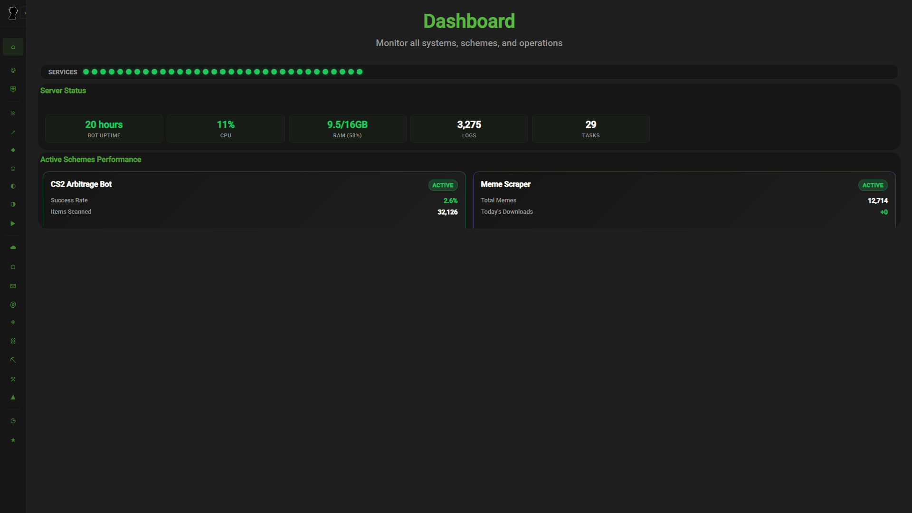
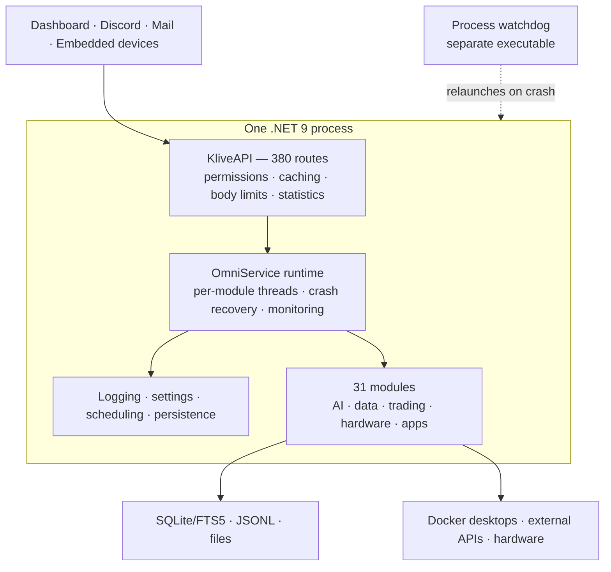
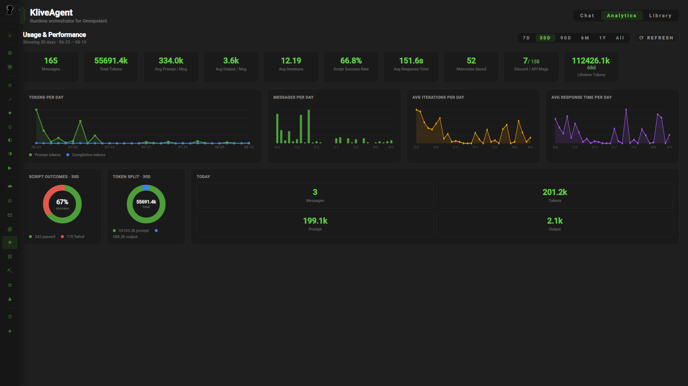
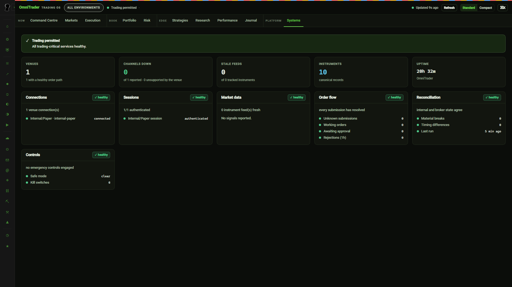
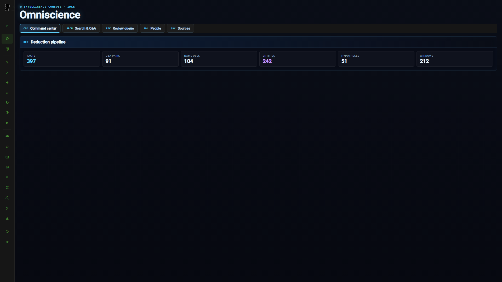

# Omnipotent

**A self-hosted .NET automation platform and modular service runtime that coordinates 31 long-running modules through shared API, permissions, monitoring, persistence and AI orchestration infrastructure.**

**31 modules · 380 permission-gated API routes · 1,363 passing tests · 136k lines of C# · in development since 2024**

Built by [Nourdin "Klivess"](https://github.com/Klivess), a University of Bath CS & AI student.

[Service runtime](Docs/service-runtime.md) · [API and security](Docs/api-and-security.md) · [Agents and retrieval](Docs/agent-and-rag.md) · [Metrics](#code-and-test-metrics) · [Private production dashboard](https://klive.uk)

<a href="Docs/assets/readme/dashboard-overview.png">
  
</a>

<p align="center"><em>The live dashboard is private. This screenshot hides log and error contents, task arguments, identities, and account details.</em></p>

## What this is

Omnipotent is a **modular service platform**, not a bot and not a microservice deployment. Every
module is an `OmniService` subclass running on its own dedicated thread inside **one .NET 9 process**,
sharing a service graph, a logger, a settings store, a scheduler and a single HTTP listener.

That choice is the design. Modules hold live references to each other instead of exchanging
serialised messages, so a new module gets persistence, configuration, scheduling, authenticated HTTP
routes and health monitoring by subclassing one base class — and the embedded agent can operate any
of them without a tool definition being written for it. The cost is blast radius, and most of the
runtime exists to pay that down: per-thread exception isolation, automatic restart of critical
modules, and an external watchdog process for whole-process death.

A separate [Nuxt 3 / Vue 3 dashboard](https://github.com/Klivess/Klives-Management-Website) talks to
it over REST and WebSockets. Docker desktops, embedded devices and the watchdog run as separate
programs.

This is a personal research and development project, not a packaged product. Running it requires
Windows, private configuration, service credentials, local data and supported hardware.



## Three systems worth reading

### 1. The service runtime

[`Service Manager/`](Omnipotent/Service%20Manager) · **[Full write-up →](Docs/service-runtime.md)**

Custom lifecycle management for in-process modules. Each module declares a priority
(`Low → Standard → High → Critical`) and gets a named OS thread at matching priority. A per-thread
`SynchronizationContext` catches exceptions escaping `async void` handlers and attributes them to the
module that caused them rather than letting them kill the process. Crashes funnel through one
idempotent handler that logs, alerts the owner, terminates cleanly, and self-restarts modules marked
Critical. Boot order is dependency-ordered with a bounded 30-second gate so a stuck prerequisite
cannot freeze startup. `OmniServiceMonitor` samples per-thread CPU and memory, system CPU and RAM, and
persists uptime periods so outage history survives restarts.

Recovery works in three widening tiers: thread, process, and an external watchdog executable that
relaunches the host and posts the crash log to Discord as an attachment.

Key files: [`OmniService.cs`](Omnipotent/Service%20Manager/OmniService.cs) ·
[`OmniServiceManager.cs`](Omnipotent/Service%20Manager/OmniServiceManager.cs) ·
[`OmniServiceMonitor.cs`](Omnipotent/Service%20Manager/OmniServiceMonitor.cs) ·
[`OmnipotentProcessMonitor`](OmnipotentProcessMonitor/Program.cs)

### 2. The permissioned API control plane

[`Services/KliveAPI/`](Omnipotent/Services/KliveAPI) · **[Full write-up →](Docs/api-and-security.md)**

One HTTP/WebSocket surface for the whole platform. Modules register their own routes at startup, and
**every registration must state a required permission** — the parameter is not optional, so no route
exists without a deliberate access decision. Ranks form an ordered ladder
(`Anybody → Guest → Manager → Associate → Admin → Klives`) checked by comparison, with a separate
`CanLogin` flag so access can be revoked without demoting a profile.

Four registration forms cover buffered, byte-capped, streamed and WebSocket routes, with limits
enforced as bytes arrive rather than after buffering. A `/batch` endpoint collapses a dashboard's
request burst into one round trip, still permission-checked per sub-request.

The response cache is **dependency-versioned rather than TTL-based**: each request runs in a scope
that records which stores it read, and writes to those stores invalidate the entries — so a cached
response is never stale. Two throughput fixes are load-bearing and were bugs first: running
`max(4, ProcessorCount)` concurrent accept loops, and offloading request handling before the pipeline's
synchronous prologue could block the accept thread and serialise the entire site.

Key files: [`KliveAPI.cs`](Omnipotent/Services/KliveAPI/KliveAPI.cs) ·
[`Caching/`](Omnipotent/Services/KliveAPI/Caching) ·
[`KliveApiStatisticsStore.cs`](Omnipotent/Services/KliveAPI/KliveApiStatisticsStore.cs) ·
[`KMProfileManager.cs`](Omnipotent/Klives%20Management/KMProfileManager.cs)

### 3. KliveAgent, Projects and cross-system retrieval

[`Services/KliveAgent/`](Omnipotent/Services/KliveAgent) · **[Full write-up →](Docs/agent-and-rag.md)** · [Architecture notes](Omnipotent/Services/KliveAgent/AGENT_ARCHITECTURE.md)

A ReAct-style agent whose action surface is **the compiler, not a tool list**. It emits C# that Roslyn
compiles and executes in-process against the live service graph, using the same reflective handles any
module uses to reach its neighbours. The consequence: adding a module adds agent capability with no
tool schema, no registration and no glue. Around that loop sit a per-category context budget, BM25
persistent memory, compaction of the oldest turns, token streaming, self-scheduled future work, and a
per-run token and wall-clock budget that force-finalises rather than capping iterations.

**Projects** extends this to autonomous work lasting weeks: a commander delegating to staffed workers,
durable event logs and digests so each wake reconstructs state, cross-wake repeat detection, budget
ledgers, model-tier routing, a hard 64-tool cap enforced by folding related tools behind an `op`
parameter, and isolated Docker desktops over VNC that the owner can take over live to clear a CAPTCHA.

**KliveRAG** serves both: MiniLM ONNX embeddings and SQLite FTS5 fused by Reciprocal Rank Fusion,
incremental connectors over agent history, distilled knowledge and repository docs, plus self-hosted
SearXNG web search. Auto-injection races a ~300–400 ms timeout and fails soft — retrieval degrading
must never stall a turn.

Key files: [`KliveAgentBrain.cs`](Omnipotent/Services/KliveAgent/KliveAgentBrain.cs) ·
[`KliveAgentScriptEngine.cs`](Omnipotent/Services/KliveAgent/KliveAgentScriptEngine.cs) ·
[`ProjectCommanderRunner.cs`](Omnipotent/Services/Projects/ProjectCommanderRunner.cs) ·
[`ContainerOrchestrator.cs`](Omnipotent/Services/Projects/Containers/ContainerOrchestrator.cs) ·
[`HybridRetriever.cs`](Omnipotent/Services/KliveRAG/HybridRetriever.cs)

## What the platform is used for

The modules below are evidence that the runtime above is genuinely extensible — they are applications
of it, not the point of it. "Active" means enabled in my private deployment; it does not mean finished,
supported for other users, or security-hardened.

| Area | Includes | Status |
|---|---|---|
| **AI and agents** | KliveAgent, Projects, KliveLLM, KliveRAG, local and hosted models | Active; some features need credentials |
| **Data and search** | Import, SQLite/FTS5 search, retrieval, behavioural statistics, deductions | Active; needs linked data |
| **Hardware and design** | Device control, telemetry, relays, firmware builds, CAD, electronics, FEA | Active with supported hardware and local tools |
| **Trading and simulation** | Backtests, paper trading, market analysis, portfolio and risk | Paper and backtest active; adapters need credentials; execution and settlement partly experimental |
| **Apps and communication** | KliveCloud, mail, chat, Discord, games, workout tools, social posting | Mixed; OmniTube is experimental |

Two of these reach past the software boundary and are worth a note:

**Stratum** treats hardware designs as revisioned artefacts — generating CadQuery geometry, checking
part and assembly constraints, managing electronics files, building PlatformIO firmware, and running
gmsh/CalculiX simulations with results persisted for review.
([`StratumContractEngine`](Omnipotent/Services/Stratum/StratumContractEngine.cs),
[`StratumGeometryVerifier`](Omnipotent/Services/Stratum/StratumGeometryVerifier.cs))

**KliveTech** connects embedded devices directly or through a relay, decoding device actions, streaming
binary telemetry, tracking device state and storing firmware.
([`KliveTechHub`](Omnipotent/Services/KliveTechHub/KliveTechHub.cs),
[`KliveTechStreamProtocol`](Omnipotent/Services/KliveTechHub/KliveTechStreamProtocol.cs))

Omniscience runs locally, importing linked data and producing aggregate behavioural statistics and
deductions. Public screenshots hide people and source data.

## Screenshots

These came from the live private dashboard and show aggregate data only. They omit chats, memories,
project names, identities, device identifiers, file paths, account data, balances and error details.

<table>
  <tr>
    <td width="50%" valign="top">
      <a href="Docs/assets/readme/kliveagent-analytics.png"></a><br>
      <sub><strong>KliveAgent, last 30 days.</strong> Usage, script results, iterations, latency and token counts. Conversations and memories are hidden.</sub>
    </td>
    <td width="50%" valign="top">
      <a href="Docs/assets/readme/omnitrader-systems.png"></a><br>
      <sub><strong>OmniTrader system status.</strong> Health checks for the internal paper venue, sessions, market data, order flow, reconciliation and controls.</sub>
    </td>
  </tr>
  <tr>
    <td colspan="2" valign="top">
      <a href="Docs/assets/readme/omniscience-command-center.png"></a><br>
      <sub><strong>Omniscience.</strong> Aggregate deduction counts. People, source material, suggestions and individual records are hidden.</sub>
    </td>
  </tr>
</table>

## Code and test metrics

Measured at commit `139b9b7` on 11 August 2026.

| Measurement | Result |
|---|---:|
| Modules started by `Program.cs` | **31** |
| `CreateAPIRoute(...)` registrations | **380 across 36 files** |
| Main C# project | **506 files · 135,905 non-empty lines** |
| Test source | **105 files · 1,129 xUnit `Fact`/`Theory` declarations** |
| Tests run | **1,363 passed · 0 failed · 0 skipped** |
| Solution build | **0 errors; 8 package warnings** |
| Projects in the solution | **4** |
| Git history | **936 commits; work began in 2024** |

```powershell
dotnet build Omnipotent.sln --nologo --verbosity minimal
$env:DOTNET_ROLL_FORWARD='Major'
dotnet test Omnipotent.Tests/Omnipotent.Tests.csproj --no-build --no-restore
```

Tests target `net9.0`. The measuring machine had only .NET 8 and 10 runtimes installed, so the run used
major-version roll-forward; a .NET 9 runtime does not need it. The build printed eight package
compatibility warnings and a non-fatal XGBoost `libxgboost.so already exists` message.

## Repository map

| Area | Path |
|---|---|
| Startup | [`Omnipotent/Program.cs`](Omnipotent/Program.cs) |
| Runtime and shared base class | [`Omnipotent/Service Manager/`](Omnipotent/Service%20Manager) |
| Modules | [`Omnipotent/Services/`](Omnipotent/Services) |
| Tests | [`Omnipotent.Tests/`](Omnipotent.Tests) |
| KliveLink client | [`KliveLink/`](KliveLink) |
| Watchdog | [`OmnipotentProcessMonitor/`](OmnipotentProcessMonitor) |
| Documentation | [`Docs/`](Docs) |

## Built with

- **Backend:** C# 13, .NET 9, `HttpListener`, SQLite, JSON/JSONL, WebSockets
- **AI and search:** Microsoft.Extensions.AI, Roslyn, LLamaSharp, ONNX Runtime, local embeddings, SQLite FTS5/BM25, Tesseract
- **Agent environments:** Docker, VNC, Python, file-based action logs
- **Dashboard:** Nuxt 3, Vue 3, TypeScript
- **Hardware and engineering:** Bluetooth, relay protocols, CadQuery, PlatformIO, gmsh, CalculiX
- **Connected services:** Discord, mail, model providers, market data providers

## Related repositories

- [Klives Management Website](https://github.com/Klivess/Klives-Management-Website) — Nuxt 3 / Vue 3 dashboard
- [KliveTech-Ecosystem](https://github.com/Klivess/KliveTech-Ecosystem) — Arduino/C++ library for connecting hardware devices
- [HevySharp](https://github.com/Klivess/HevySharp) — .NET wrapper for the Hevy API
